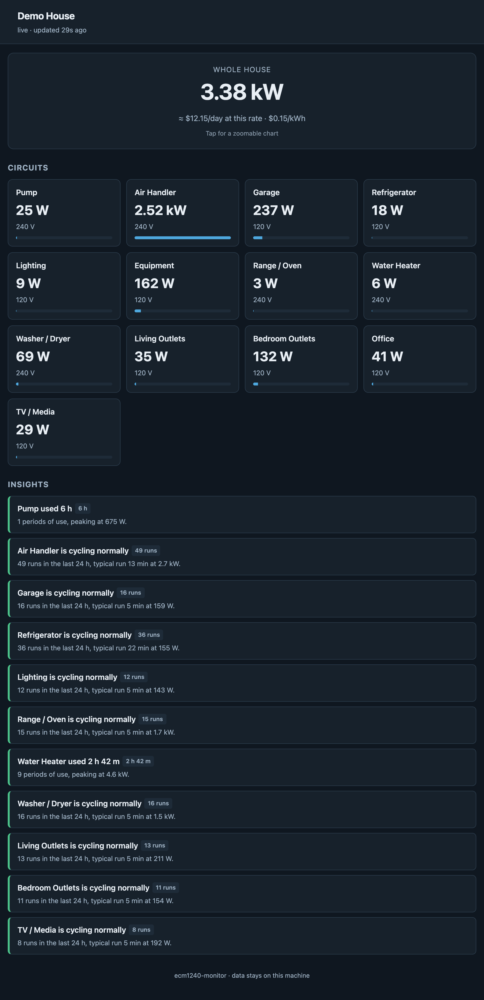
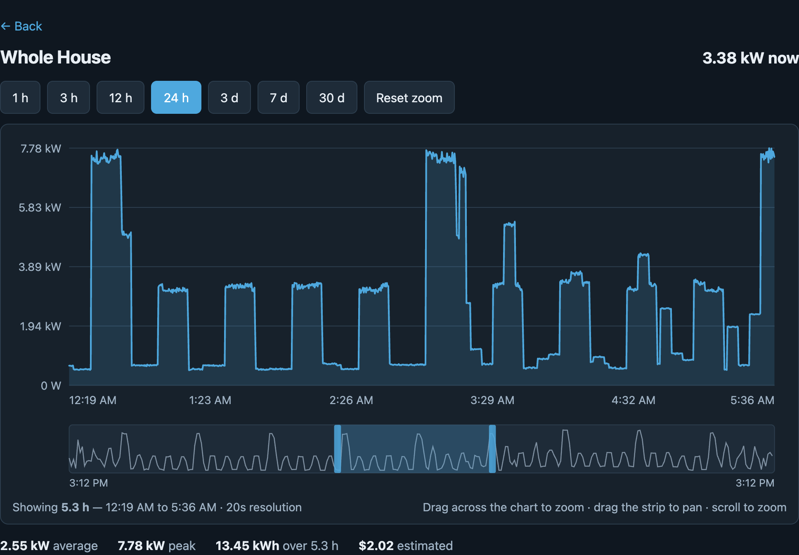

# ecm1240-monitor

A local, no-cloud energy monitor for the **Brultech ECM-1240**.

Reads one or two meters over serial, stores everything in SQLite on the machine
in your own house, and serves a live dashboard with history, cost estimates and
appliance-health insights. Nothing is uploaded anywhere. There is no account, no
subscription and no service that can shut down and take your data with it.

Built because the ECM-1240 is discontinued and every cloud service that once
consumed it — Smart Energy Groups, PlotWatt, MyEnerSave, WattzOn — is dead,
leaving a lot of working hardware with nowhere to send its data.

<p align="center">
  
</p>

<p align="center">
  
  <br><em>Drag across any chart to zoom — it re-asks the API for that window at full resolution.</em>
</p>

*(All screenshots are from the built-in demo generator, not a real home.)*

```
   breaker panel                Raspberry Pi (or any Linux box)
   ┌────────────┐               ┌──────────────────────────────┐
   │ CTs on the │  RS-232       │  collector ──> SQLite        │
   │ circuits   │──19200 8N1──> │       │         (WAL)        │
   │            │  over Cat5    │       │           │          │
   │ ECM-1240 A │  + USB serial │       │           v          │
   │ ECM-1240 B │──adapter────> │       │      read-only API   │
   └────────────┘               │       │           │          │
                                │       v           v          │
                                │  live CSV     dashboard      │
                                │  (optional)   + insights     │
                                └──────────────────────────────┘
```

> [!IMPORTANT]
> ### Meter looks dead? It probably isn't.
>
> **This is the single most common problem with an ECM-1240, and it is not a
> fault.** A meter with real-time mode switched off is *completely silent* — no
> packets, ever — but it is alive and will still answer a direct poll. It looks
> exactly like a dead board, and people replace working hardware over it.
>
> Check before you suspect anything:
>
> ```bash
> python3 tools/ecm_poll.py /dev/ttyUSB0 -v      # does it answer a poll?
> ```
>
> If it answers, real-time mode is off. Switch streaming back on:
>
> ```bash
> python3 tools/ecm_realtime.py /dev/ttyUSB0 --on
> ```
>
> If it does *not* answer a poll either, see
> [`docs/TROUBLESHOOTING.md`](docs/TROUBLESHOOTING.md) — check the **12 VAC**
> supply first, then the cable, then whether another program is holding the
> serial port.

## Try it with no hardware

```bash
git clone https://github.com/Verohomie/ecm1240-monitor.git
cd ecm1240-monitor
python3 -m venv .venv && source .venv/bin/activate
pip install -r requirements.txt

python3 tools/make_demo_data.py --db demo.db --days 7
python3 -m ecm1240.api --config config.demo.yaml
```

Open <http://127.0.0.1:8080/>. That is the whole application running on
synthesised data — no meter, no panel, no wiring. Every screenshot in this
project comes from that demo, never from a real home.

## The dashboard

Tap the whole-house figure, or any circuit, for a chart you can actually
explore:

- **Drag across the chart to zoom.** Drag the strip underneath to pan, or its
  edges to resize. Scroll to zoom around the cursor. Touch, trackpad and mouse
  all work.
- **Zooming re-asks the API for that window at full resolution** rather than
  magnifying what was already loaded. Pull one evening open on a 24-hour view
  and the buckets go from ~90 seconds to ~20 — you see the real shape of a
  compressor cycle instead of a smoothed average.
- **Charts are a real address** (`#/chart/0/aux1`), so the browser Back button
  and a touch back-swipe both work.

All of it is **hand-written SVG with no JavaScript dependencies** — no charting
library, no framework, no CDN. The whole front end is one readable file, which
matters for software that runs on your own network and reads your household's
activity. It also works with the internet unplugged.

## What you need

| | |
|---|---|
| **Meter** | One or two Brultech ECM-1240s, with their **12 VAC** transformers |
| **CTs** | Current transformers on the circuits you want to see |
| **Link** | RS-232 from each meter to the host — USB serial adapter, or a serial-to-Ethernet gateway |
| **Host** | Any Linux machine. A Raspberry Pi is plenty. **Put the database on an SSD or USB drive, not the SD card** — at a 5-second sample rate an SD card will wear out |
| **Python** | 3.9 or newer |

## Install

```bash
sudo apt install python3-pip python3-venv
git clone https://github.com/Verohomie/ecm1240-monitor.git
cd ecm1240-monitor
python3 -m venv .venv && source .venv/bin/activate
pip install -r requirements.txt

cp config.example.yaml config.yaml
nano config.yaml
```

`config.example.yaml` is commented line by line. The two things you must set are
the **serial port** for each meter and the **channel names** for your circuits.

### Finding your serial ports

```bash
ls -l /dev/serial/by-path/
```

**Use a `by-path` name, not `/dev/ttyUSB0`.** This matters more than it looks:

Every ECM-1240 reports `unit_id=0` in its packets no matter how it is
configured, so the only way to tell two meters apart is which port each is
plugged into. `ttyUSB` numbering changes between reboots, and cheap PL2303
adapters report no serial number so `by-id` names collide. If two meters swap,
one meter's counters get subtracted from the other's and every reading after
that is wrong — with no error and no visible symptom.

After any change to your USB wiring, check the mapping still holds:

```bash
python3 tools/verify_unit_identity.py
```

### Run it

```bash
python3 -m ecm1240.collector          # reads the meters, writes the database
python3 -m ecm1240.api                # serves the dashboard
```

For a permanent install, see [`docs/INSTALL.md`](docs/INSTALL.md) for the
systemd units.

### Insights (optional)

Appliance-health rules need to know what "running" means for each of your
circuits. Those numbers depend on your appliances, so there are no defaults.
After a few days of logging, derive them from your own data:

```bash
python3 tools/suggest_profiles.py --explain > profiles.yaml
```

It finds the empty gap in each circuit's watt histogram — the space between
"off" and "running" — and puts the thresholds there, then classifies each
circuit from how it behaves over time. **Read the result before trusting it**:
it knows that a channel has two states 650 W apart, not that the channel is
your pool pump.

Then run the pass (a systemd timer every 15 minutes is typical):

```bash
python3 -m ecm1240.insights
```

Two of the checks need **no profiles at all** and work from the first day, since
they run off the config and the readings rather than off your appliances:

- **Service voltage** — how often the supply left the normal band, and which way
  it went. Readings below `voltage.dead_below` are excluded on purpose: an ECM
  senses the line through its own AC adapter, so an unplugged adapter or a power
  cut reads as the voltage collapsing to zero, which is a different problem from
  a brownout and should not be reported as one.
- **Unmetered load** — the mains minus every metered branch, i.e. how much of
  the house has no CT on it. Judged on the median and the quietest tenth of the
  day rather than the peak, so a large occasional load with no CT (an EV
  charger) does not report itself every night, while a CT that has come loose
  shows up immediately and stays.

## ⚠ Safety

**This project requires current transformers inside a live electrical panel.**

Mains conductors carry enough energy to kill you and to start a fire. Clamping
CTs onto service conductors is not a casual DIY job. **If you are not qualified
to work in a live panel, hire an electrician** — the meter and the software will
still be here when they have finished.

The meters themselves have two traps that destroy hardware:

- They need **12 VAC**, not 12 VDC. A DC supply of the same size and plug will
  destroy the board. The transformer is also the meter's voltage reference.
- **Never power one up while holding F1** — it erases the CT calibration.

This software is provided as-is, with no warranty. See [`LICENSE`](LICENSE).

## ⚠ Privacy

Your energy database is sensitive. A per-circuit record shows when people are
home, when they sleep, when the house is empty and when you went away. Treat it
the way you would treat a door log.

- The API has **no authentication**, and defaults to `127.0.0.1` for that reason.
- **Do not port-forward it.** If you want access from outside, use a VPN.
- Do not publish screenshots or database extracts of real data — use the demo.

See [`docs/SECURITY.md`](docs/SECURITY.md).

## Documentation

**Start here** — both are illustrated HTML pages; open them in a browser
(or read them on GitHub via [htmlpreview](https://htmlpreview.github.io/)):

| | |
|---|---|
| [`docs/deployment-guide.html`](docs/deployment-guide.html) | **Wiring → install → calibration → live.** Safety rules, the traps that destroy meters, and a commissioning checklist |
| [`docs/user-guide.html`](docs/user-guide.html) | **Using it day to day.** Dashboard and chart anatomy, what the insights mean, and how to swap in a charting library if you want one |

Reference:

| | |
|---|---|
| [`docs/INSTALL.md`](docs/INSTALL.md) | Permanent install, systemd units, backups |
| [`docs/SECURITY.md`](docs/SECURITY.md) | What is exposed, and what to do about it |
| [`docs/CALIBRATION.md`](docs/CALIBRATION.md) | Getting the numbers right — and the double-counting trap |
| [`docs/TROUBLESHOOTING.md`](docs/TROUBLESHOOTING.md) | Dead meter, wrong watts, missing data |
| [`CREDITS.md`](CREDITS.md) | Prior work this builds on |

## Tools

| Tool | What it does |
|---|---|
| `tools/ecm_realtime.py` | Turn real-time mode on/off. **A meter with it off looks completely dead** but still answers a poll — this brings it back |
| `tools/ecm_settings.py` | Read back CT type/range, firmware, unit id. How you discover your mains CTs are programmed wrong |
| `tools/ecm_sniff.py` | Watch a meter talk, live — decoded packets and derived watts. First tool to reach for |
| `tools/ecm_poll.py` | Polled-mode fallback |
| `tools/ecm_probe.py` | Raw counter dump for diagnosing a bad interval |
| `tools/ecm_interval.py` | Set the packet send frequency |
| `tools/verify_unit_identity.py` | Confirm each meter is the one you think it is |
| `tools/test_dualport.py` | Full dual-meter test using pseudo-terminals — **no hardware needed** |
| `tools/test_history_buckets.py` | Checks `/api/history` bucket averaging against a throwaway database — **no hardware needed** |
| `tools/test_chart_gaps.js` | Checks the dashboard breaks its charts where a meter stopped recording — **no hardware needed** |
| `tools/suggest_profiles.py` | Derive insight thresholds from your own data |
| `tools/make_demo_data.py` | Generate a fake week for demos and screenshots |

## How this compares to btmon.py

[**btmon.py**](https://github.com/matthewwall/mtools) (Matthew Wall, GPLv3) is
the established public ECM-1240 tool and it is good. It supports more hardware
(ECM-1220, GEM) and uploads to many databases and services. **If you want a
proven collector with lots of output targets, use btmon.**

This project is a different shape: a **self-contained local stack** — collector,
history, dashboard, cost estimates and appliance insights — that runs on one
machine and talks to nothing. It supports the ECM-1240 only. Pick whichever fits
what you are trying to do.

## Origin and independence

This is an independent implementation of the ECM-1240 protocol and contains no
third-party code. The packet format is decoded from Brultech's published
specification, verified against live hardware. Prior community work on this
protocol is credited in [`CREDITS.md`](CREDITS.md) — those people worked this
out years ago and made it easy to verify.

Not affiliated with or endorsed by Brultech Research Inc. The ECM-1240 manuals
are Brultech's copyrighted documentation and are not redistributed here;
download them from [brultech.com](https://www.brultech.com/).

## Licence

MIT — see [`LICENSE`](LICENSE).
